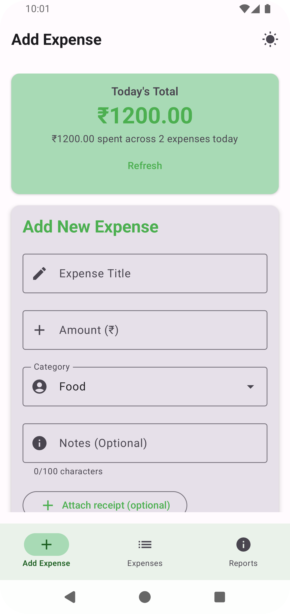
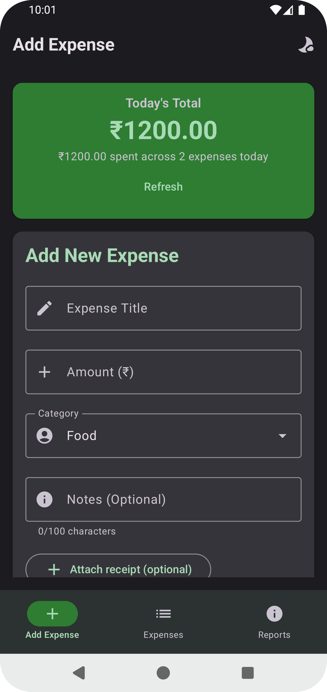
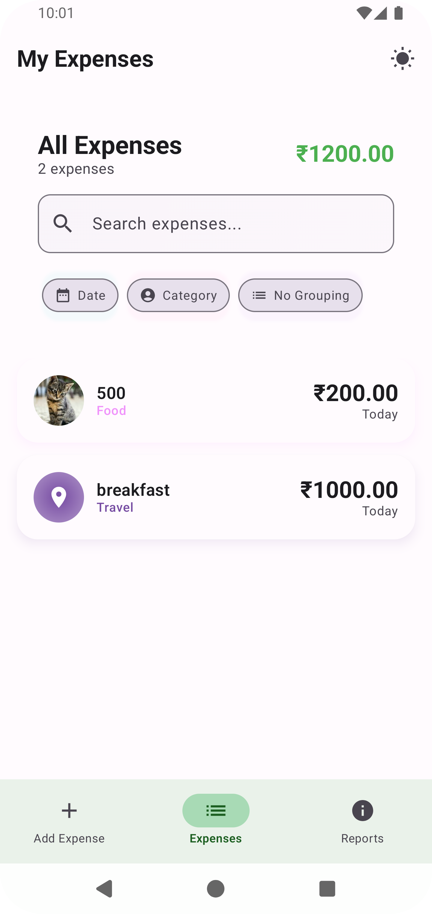
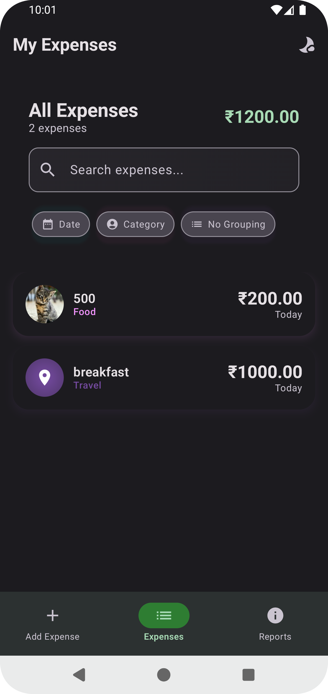
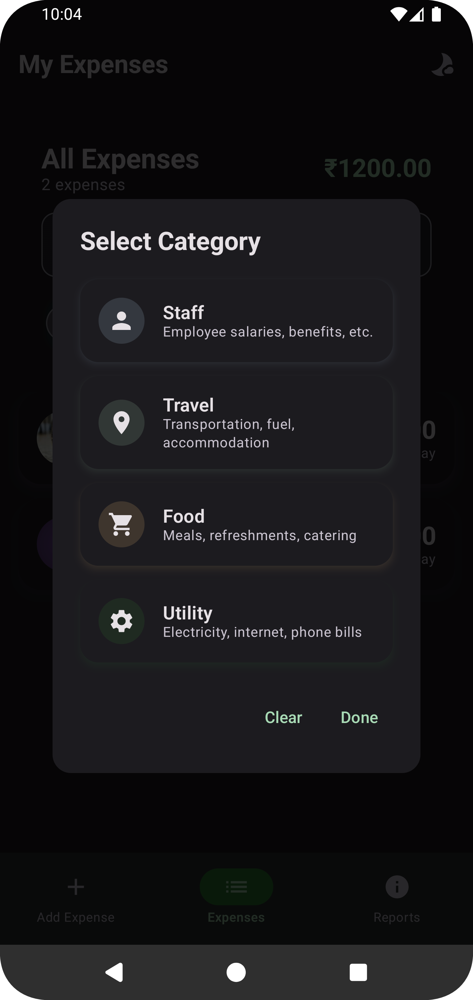
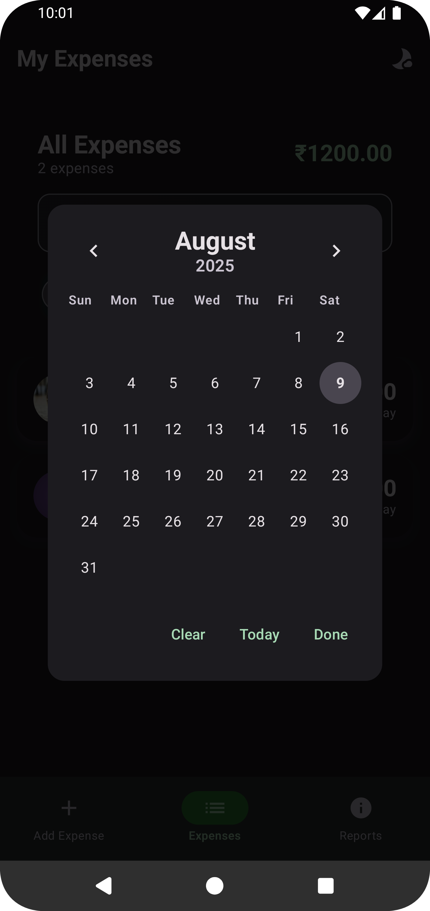
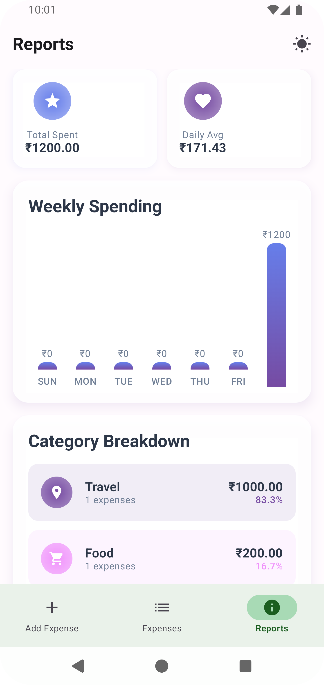
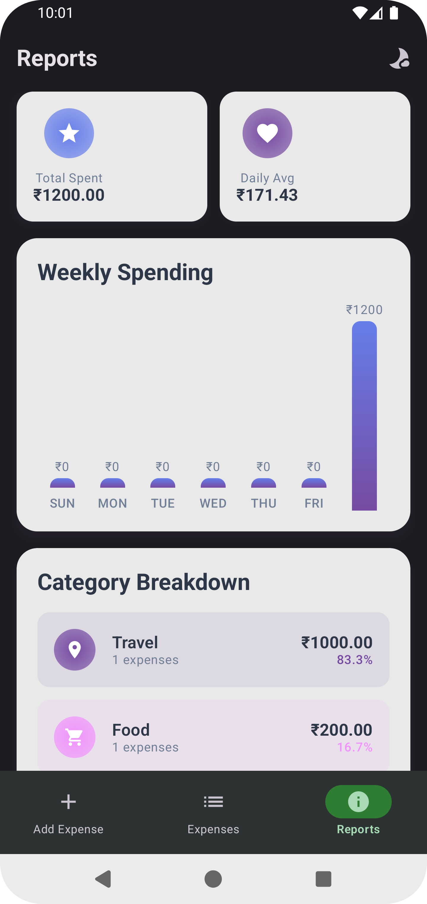

# Smart Expense Tracker

[](https://developer.android.com/jetpack/compose)
[](https://kotlinlang.org/)
[](#)
[](#)

## App Overview
Modern expense tracking app built with Jetpack Compose, Clean Architecture, Hilt, and Room. Designed end‑to‑end in Cursor with an AI‑first workflow and documented under [`context/`](context/).
It enables quick expense entry, powerful filtering, and simple weekly insights—all fully offline with optional persistence.

## 📱 Download

[](https://github.com/ShankarKakumani/SmartExpensetracker/releases/download/v1.0/app-release.apk)

APK: Ready to install directly on your Android device. Download and install the `app-release.apk`.

## AI Usage Summary
Built in an AI‑first workflow using Cursor with ChatGPT to scaffold modules (ViewModels, repositories, Room entities/DAOs), generate Compose UI, and refine UX copy/validation.
Copilot assisted with boilerplate and quick refactors, while iterative prompts guided architecture decisions and navigation/state handling.
All key prompts, retries, and decisions are logged under [`context/`](context/) for transparency and reproducibility.

## Prompt Logs (Key Prompts)
> Plan Clean Architecture and module boundaries for SmartExpensetracker; mirror patterns from JarOnboardingAnimation.

> Scaffold ExpenseEntryViewModel with StateFlow, validation (title non‑empty, amount > 0), and addExpense handler.

> Compose UI for ExpenseListScreen with date/category filters, grouping toggle, empty/loading states.

> Create Room entities/DAO for expenses and mappers between domain/data layers.

Comprehensive logs: see [`context/execution/prompts.md`](context/execution/prompts.md).

## Checklist of Features Implemented
- [x] Expense Entry: title, amount, category (Staff, Travel, Food, Utility), optional notes, optional receipt image (cached; path saved in Room)
- [x] Real‑time “Total Spent Today” summary with validation
- [x] Expense List: today by default, date/category filters, grouping (none/category/date), search, empty and loading states
- [x] Reports: last 7 days analytics with daily totals, category breakdown, bar chart
- [x] Theming: Material 3 with light/dark support
- [ ] Export/Share from Reports (optional in spec; currently not enabled)

## Screens
- Add Expense ([`ExpenseEntryScreen.kt`](app/src/main/java/com/shankarkakumani/smartexpensetracker/presentation/expense_entry/ExpenseEntryScreen.kt))
- Expenses ([`ExpenseListScreen.kt`](app/src/main/java/com/shankarkakumani/smartexpensetracker/presentation/expense_list/ExpenseListScreen.kt))
- Reports ([`ExpenseReportScreen.kt`](app/src/main/java/com/shankarkakumani/smartexpensetracker/presentation/expense_report/ExpenseReportScreen.kt))

## Screenshots

<table>
  <tr>
    <td></td>
    <td></td>
    <td></td>
  </tr>
  <tr>
    <td></td>
    <td></td>
    <td></td>
  </tr>
  <tr>
    <td></td>
    <td></td>
    <td></td>
  </tr>
</table>

<sub>Tip: Click an image to open it full size on GitHub.</sub>

## Architecture
- Clean Architecture (modules: [`app`](app/), [`domain`](domain/), [`data`](data/), [`common`](common/))
- State‑driven UI with `StateFlow` ViewModels per screen
- Hilt DI modules for repositories, data sources, Room database
- Room for local persistence ([`ExpenseEntity.kt`](data/src/main/java/com/shankarkakumani/data/client/room/entity/ExpenseEntity.kt), [`ExpenseDao.kt`](data/src/main/java/com/shankarkakumani/data/client/room/dao/ExpenseDao.kt), [`SmartExpenseDatabase.kt`](data/src/main/java/com/shankarkakumani/data/client/room/database/SmartExpenseDatabase.kt))
- Mappers converting between domain and data models ([`ExpenseMapper.kt`](data/src/main/java/com/shankarkakumani/data/mapper/ExpenseMapper.kt))

## Data Model
- Domain models: [`Expense.kt`](domain/src/main/java/com/shankarkakumani/domain/model/Expense.kt), [`ExpenseCategory.kt`](domain/src/main/java/com/shankarkakumani/domain/model/ExpenseCategory.kt), [`WeeklyReport.kt`](domain/src/main/java/com/shankarkakumani/domain/model/WeeklyReport.kt)
- Receipt images are copied to app `cacheDir` and previewed immediately; cached file path is saved to Room for retrieval

## UX Notes
- Material 3 color scheme and typography for contrast in light/dark
- Dialogs (date/category/grouping) use clean surfaces and text buttons
- Search bar, chips, and cards follow Material guidance

## Quickstart
Prereqs: JDK 11+, Android Studio (latest), Android SDKs.

Build & install debug:

```
./gradlew :app:assembleDebug
./gradlew :app:installDebug
```

Run unit tests:

```
./gradlew test
```

Run instrumentation tests (device/emulator required):

```
./gradlew :app:connectedAndroidTest
```

Build release APK:

```
./gradlew :app:assembleRelease
```

APK output: `app/build/outputs/apk/release/app-release.apk`

Signing (release): configure `signing.properties` at project root:

```
storeFile=keystore/release.jks
storePassword=...
keyAlias=...
keyPassword=...
```

Default values are provided for local builds. Replace with your own keystore for distribution.

## Testing
- Test scaffolds live in `app/src/androidTest` and `app/src/test`.
- Suggested tasks: `./gradlew test` and `./gradlew :app:connectedAndroidTest`.

## AI‑First Development in Cursor
This project was created with AI assistance in Cursor. The `context/` folder documents the process:
- [`context/requirements/original_requirements.md`](context/requirements/original_requirements.md): authoritative scope and acceptance criteria
- [`context/docs/architecture.md`](context/docs/architecture.md): architecture decisions
- [`context/execution/tasks.md`](context/execution/tasks.md) and [`implementation.md`](context/execution/implementation.md): step‑by‑step execution log
- [`context/execution/prompts.md`](context/execution/prompts.md): representative prompts
- [`context/ai-usage.md`](context/ai-usage.md): summary of AI usage

Workflow notes:
- Iterative edits generated by AI in Cursor
- UI/UX refinements (contrast, dialog clean‑up, header layout) evaluated live on device
- Repository, Room entities/DAOs, DI modules, and ViewModels scaffolded and refined by AI

## Folder Structure
```
SmartExpensetracker/
  app/        # Compose UI + ViewModels + navigation
  domain/     # Use cases, domain models, repository interfaces
  data/       # Room DB, DAOs, data sources, repository impl, mappers
  common/     # Shared utilities and base constructs
  context/    # Requirements, architecture notes, AI usage & prompts
```

## Notes & Limitations
- Export/share from Reports is optional in the spec and currently disabled
- Receipt images are stored in cache; clearing app cache removes files (the DB path remains). Switch to `filesDir/receipts` if persistence across cache clears is required

## License
For assignment/demo purposes.


